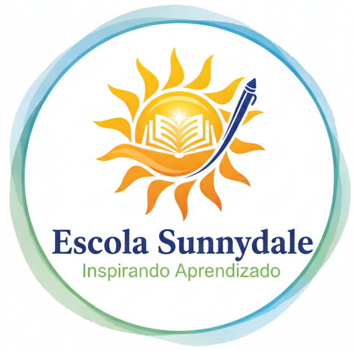

# Sunnydale School ☀️

Bem-vindo ao cantinho da **Sunnydale School**!
Aqui você encontra tudo sobre nossa escola fictícia, estrutura, programas, eventos e muito mais. Sinta-se acolhido pelo nosso universo educativo! ✨


## Sobre o Projeto
Este site foi criado com carinho como parte do curso de Programação, com o objetivo de praticar HTML, CSS e JavaScript, simulando o site institucional de uma escola criativa e acolhedora. Tudo feito para aprender, inspirar e compartilhar! 💛


## ✨ Funcionalidades
- **Página Inicial:** Apresentação da escola e sua missão.
- **Sobre Nós:** História e estrutura da escola.
- **Nossos Programas:** Detalhes dos cursos e atividades.
- **Eventos:** Agenda de eventos escolares.
- **Corpo Docente:** Conheça nossos professores fictícios.
- **Contato:** Formulário para enviar mensagens (simulado).


## �️ Tecnologias Utilizadas


## �️ Estrutura do Projeto

```
Sunnydale-School/
├── index.html           # Página principal
├── css/
│   └── style.css        # Estilos do site
├── img/                 # Imagens e logos
├── script/
│   └── script.js        # Scripts JS para interatividade
└── README.md            # Este arquivo
```


## 🌐 Como Visualizar

Você pode acessar o site de duas formas:

- **Clonando o repositório:**

```bash
git clone https://github.com/WxnyWxnyinha/Sunnydale-School.git
```
Depois, é só abrir o arquivo `index.html` no seu navegador favorito e aproveitar!


## 🎀 Créditos

Site desenvolvido com muito carinho como parte das atividades do curso de Programação de Sistemas.


## � Contato
Para dúvidas, sugestões ou só para mandar um recadinho fofo, utilize o formulário de contato do site. Vamos adorar ouvir você! �

---
<div align="center">
	<b>Sunnydale School: aprendendo e crescendo juntos! Obrigado por visitar nosso projeto! ☀️💛</b>
</div>
